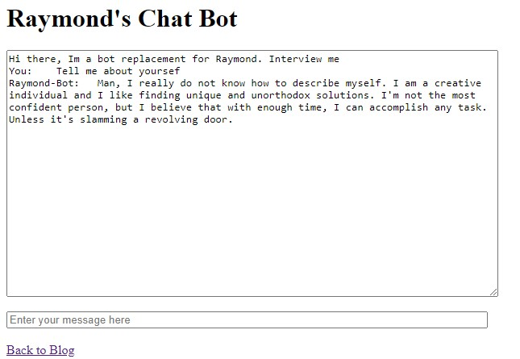

<h2 class="font-italic font-weight-bold" align="center"> The Penultimate Chapter of Interview Bot
 </h2> 

Before I took a hiatus from working on my interview bot, I was trying to create and set up a websocket to integrate the bot as another feature on my site. That process would involved me setting up an websocket API on the backend, hosted on a server somewhere, then I would have had to design the actual react component on my site to make those calls. And I have to say, I was close to completing it.   
  
I had gotten my API set up with Flask, built a working websocket, and had a basic template set up with HTML. Just to show that I'm not lying to you, I've attached a photo of the websocket working below. You can also see the branch that I was working on that [**here**](https://github.com/rayyungdev/interview-bot/tree/chatapp)  

<figure align='center'>

<figcaption align = "center" ><b> ChatBot Websocket Working</b> </figcaption></figure>  

However as I was looking up ways to actually set up the server, I realized that I didn't have a good FREE choice. I tried serverless and I though about setting up a free E3 instance on AWS, but alas, to no avail. I wasn't able to set up a serverless instance, because I couldn't find a working layer to implement the spaCY transformer and the crap free tiered AWS instance with 1GB of ram didn't seem worth it.   
  
T hen I thought, hmm why don't I just host it on my own computer? Well, look... I learned enough about websockets to admit that I don't know enough about them. You see, yes, I can set it up to the point that it's functional, however, I'm not confident in my own networking skills to secure it. For those of you who don't know, websockets have a lot of vulnerabliities. And unfortunately, I don't know enough about those vulnerabilities and how they work to make me feel comfortable with using it.   
 
So... I thought about giving up. I figured, "hey, I have it working, that's enough... Screw it, whatever" But... here's the thing, this project wasn't just a resume boosting project, this was a personal passion project that I want to show people and have them interact with. Not just that, I wanted people to interact with it so that I could continue building a dataset because an interview question dataset just does not exist.  
  
This made me realize something about myself and also a new response to the question, "Tell me about yourself". I'm a person that comes up with creative solutions. I like thinking outside of the box. I was pidgeon holing myself to only thinking about a react component, a whole webserver. Don't get me wrong, this would definiltey be the preferred route, but it's not the only one. You see, a while ago, I had a couple of other project ideas that involved Discord, an extremely popular chat application that was originally built for gamers but has now been purposed for everything from school to work place setups. I was building the following: 
1. Benderbot
    - Based on the character from Futurama, this bot was SUPPOSED a bot that acted like the character Bender. I never actually finished the project, but it did interact with people but not in the way I wanted it to. 
    - GitHub Linked here: 
        - https://github.com/rayyungdev/tf_benderbot
2. Betabot
    - A bot I built that was meant to help moderate who entered a channel. 
        - This was built because I noticed that when people were given access to a server, they could immediately see everyone in the server.
    - I kinda finished this bot. Never really used it.... but whatever. 
    - Link to the repository here: 
        - https://github.com/rayyungdev/betabot  
          
You see where I'm going with this? Instead of building a bunch of things from scratch and still have myself vulnerable, why don't I build a working and interactable bot with Discord? Sure, it would mean that people need a Discord Account, but that's what all them cool kids have nowadays. And yes, Discord still isn't necessarily the more secure place, but it's' still better than my amatuerish attempt. I feel a lot more confident hosting a discord bot than my own websocket (_please train me_).  
  
Anyway, now that I know I'm going to use the Discord API, this now allows me to utilize a whole new set of features that I'm excited about. But that's going to be a surprised in my next update, which hopefully will be the last! So... 

## See you in the next update!