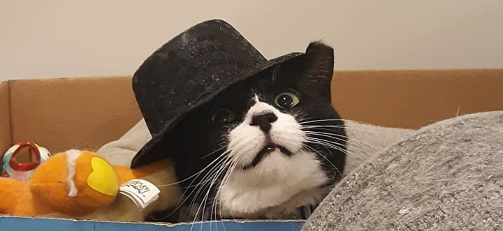
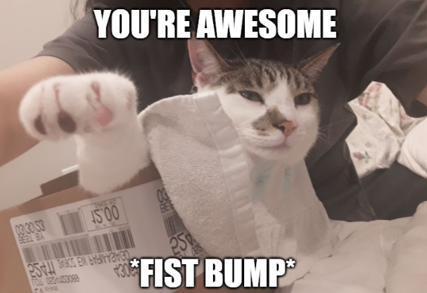

## ***My path so far...***
So after 7 long long years, I'm finally done with both college and graduate school. I definitely feel more free, although admittedly still stressed about my future employment opportunities, but hey, baby steps! This is why I decided to start this blog; to continue my journey of learning and also have a way to display what I've learned and what I'm working on. At the moment it's built with only html, but I hope to move this to Node.js as I get more familiar with it. If you're wondering who the adorable cat is in both the top and bottom photo; the top photo is my roommate's lovely foster cat, Beyonce. The one below is my adorably fat cat, Kiki. I figured that their photos would add a bit more flare to my blog.

## ***What's the plan with the Interview FAQ Section***
You might be wondering, "what's going on with the Interview FAQ button?" I have a couple of plans for that actually, but first let me give you some background:

As you already know, I don't have that much web development experience. I did go to school for 7 years, so you'd think I would have something to show for it, especially if a good portion of my time spent there was programming. But, let me be honest, while I learned a lot about machine learning algorithms, I didn't learn enough to apply them. In a way, I learned how to fly before I could run.

Also, in case you can't already tell by my posts, I'm not good at selling myself, which makes me quite terrible at interviews, which led me to creating the FAQ Section! I wanted to practice my interviews and share my answers to the world! Kinda.

You see, now that I'm done with school, I wanted to explore my own creativity. I want to put what I learned to the test. My long term goal with that section is to create a chatbot to do interviews for me, that way I can apply the machine learning techniques that I've learned. My first idea right now is to find a way to map the user input to to my different questions and return the answer mapped to the question. Not that complex, but not bad for a beta version, right?