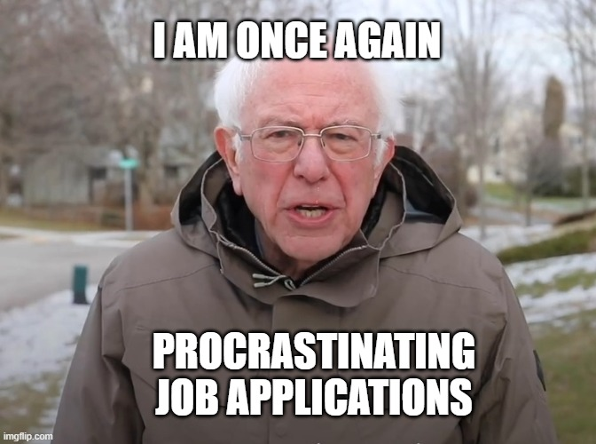

<h2 class="font-italic font-weight-bold" align="center"> What is it this time...? 
 </h2>  

Recently, it has come to my attention that I've been spending too much time trying to build my chatbot and not enough time on fixing resume and applying to jobs. Remember, I got started on these projects so that I would have something to show for on my resume. Now that I have a working website and a working model for my bot (_although I haven't integrated it yet..._), I should really now focus on fixing my resume. 

### _10 Minutes Later..._ ###

<figure align='center'>

You see, I have gotten a lot of advice on how to fix my resume to find the ***perfect job***. My current resume (which can be found on my side bar) isn't particularly outstanding. As my friend Xi has put it: 
<figure align='center'>

In other words: **it's ugly**  
  
Furthermore, I was told I should tailor my resume to the different roles I'm going to apply to. So if I'm applying to a web development role, I try to present only my web development projects (_which really is just this blog..._). Now upon realizing that I have to create multiple resumes that have only small changes to each one, I find myself being overwhelmed with too many options! Are my previous job experiences more important? Which projects should I prioritize? Recent ones, most relevant ones? There's just so many. Now how many different resumes am I supposed to create? Ahhhh!!!  

Anyway, now that I understand the basic aspects of web-development, I wondered why isn't there something like a static-site-generator for resumes?. All resumes generally have practically the same layout, right? They all have headers, an education section, whatever. All I would then update is the experience sections, right? But... now that I think about it, even it something like that were to exist, it wouldn't really be tailed to my own experiences... 
  
Long story short, I'm taking a break from trying to integrate my chatbot to create my own resume building program. I figured, trying to integrate these things is gonna take a bit and I really want to apply to jobs. Also this resume builder shouldn't take too long since I won't need to integrate that to my blog. Once it's done, it's done. My hope is that it'll streamline future job applications. 

<h2 class="font-italic font-weight-bold" align="center"> Building the Builder 
 </h2> 

Like I did with my chatbot, I'm going to think about this in two parts:  

1. How am I going to structure my data
    - This seems more important since I need to know exactly what data I'm pulling and how I might go about that  
  

2. Building the actual program
    - Well, seems less important at the moment because I at least know what my end result will be. 
  
#### **Part 1:** Structuring the Data  
The idea for this project is also inspired by what I learned previously about intent classification. While I don't plan building a learning model for it... _yet_, I think a good way to go about this is by tagging my projects and experiences with intents. Speaking of projects and experiences, I've been told that experience is more important than personal projects, but relevant projects beat random experience, and relevant experience triumphs over all. Plainly speaking, we have an inherent hierarchy to utilize!  
So my plan is this: I'm going to create a csv file where each row represents a project/job that I've done. The row is then divided into the following columns: 
1. Start Date
2. End Date
3. Project/Job Title
4. Project or Job 
5. Relevant tags
6. Company Name (will be empty if it's a project)
7. Contains the details of the project/job
    - Might separate these details into their own columns
    - Might think about using intent classification in the future to classify the details to the intent (will only work if I have a multitude of descriptors) 
  
Alright... So in hindsight, I think I might've oversimplified my solution a bit. After looking at my friend's resumes, I realized that I completely glossed over other sections, like *Skills*, *Certificates*(although I have none... oops), and *Relevant Coursework*. I forgot that these sections (for the most part), can also be tailored to the job description. This might be the imposter syndrome talking, but I don't think I've developed enough skills to really pick and choose which ones I can throw on there, but hey, I gotta start thinking about future me, right? I am sure future me will be a whole variety of skills for future career aspirations. This is for you Future Ray!  
 
Anyway, let's do this. I'm going to create a Skills CSV. It will contain the following columns:  
  Programming Languages, Software & Tools, Technical Skills, and Certificates. 
- If I find out that I actually have "too many" skills and I might try to create another intent classification model to identify the most relevant skills. 
- My friend Trung suggested that I add some of my relevant coursework for my technical skills. 

#### **Part 2:** Building the program

So... I haven't gotten this started yet (since I haven't even gotten my data built yet)... Stay tuned for a project update for this procrasination project!