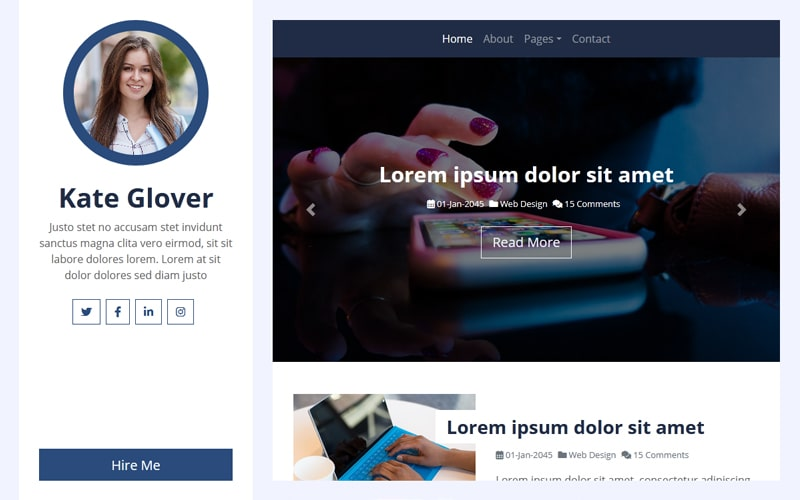

**Background**

When I first started this projected, I used a bootstrap HTML template from **[htmlcodex.com](https://htmlcodex.com/personal-blog-template)**. It looked like this: 
<figure>

<figcaption align = "center" ><b> Original HTML template </b> </figcaption>
</figure>

As you can see with my blog here, it's pretty similar. I made some changes to the CSS to make the articles wider and I removed some features/links that I thought was unnecessary, like the "blog detail" and "blog grid". After I made these adjustments, rayyungdev.github.io v0.0.01 was born. 

<h1 align="center"> Moving to Gatsby </h1>
  

At this point, I had no idea how to write javascript, let alone react/gatsby, so it was a bit of a struggle. But I soon understood the pattern between my html template and other codes that I was looking at and the conversion was pretty self explanatory, like changing **HTML's** `
` to **react's** `
`.  Again, I'm still new to react and web-development in general so I'm sure I'm not making the most out of gatsby yet, but hey at least I'm starting something, right? 

    
While I still didn't understand components, plugins, etc, I did know what kind of features I wanted in my site. I knew I wanted to be able to scroll down infinitely on the home page to see my blog history. I also knew that I wanted featured-pictures from my blog posts to populate my homepage. I tried to figure out how to learn all of this by watching a Gatsby Tutorial on youtube that was 9 hours long, but I called it quits after 40 minutes. Don't get me wrong, it was helpful, but just did not have the patience. Instead, I looked at <https://www.gatsbyjs.com/starters/> and found the templates that had the features I wanted and tried to implement them the same way, which led me to <https://www.gatsbyjs.com/starters/gatsbyjs/gatsby-starter-blog/>.

**What were the Changes**

I had discussed some changes in my blogpost, but given that this is my project section, this is I did specifically:   

1. **Components:**
    - Header
    - Navbar
        - I removed some things from the original navbar because I just didn't see the point. I might throw in the page button again, but until I have like 5 posts, I just don't see it being necessary just yet. 
    - Sidebar
    - Layout  
  
2. **New Pages:**
    - This is for ongoing projects, but I have 3 different routes that I'm still working on: 
        - Blogs
            - specifically for my blog post
        - Projects
            - specifically for my projects (like this), although I really only put this here so I would have a reason for my banner/carousel
        - Interview
            - Honestly, not necesarry but this will be changed up later
    - My goal for this section later is to designate specific templates depending on some things.... 

